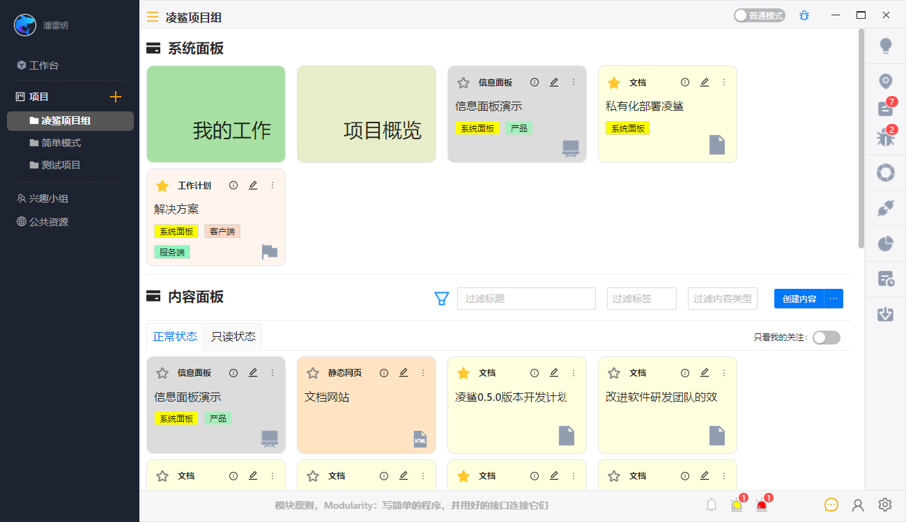

[](https://www.linksaas.pro)


# 凌鲨简介
作为软件研发团队的信息枢纽，凌鲨连接了研发过程中所需的工具和信息，从而实现研发过程中的高效沟通，知识沉淀，合理评估。

凌鲨在工作场景下使用，我们目前只提供基于PC的客户端。我们使用了[Tauri](https://tauri.studio)框架开发，客户端可以运行在windows,macOs以及linux上。

## 使用凌鲨进行高效沟通

为了符合软件开发的习惯，我们用项目来组织信息，在项目里面可以创建多个频道进行不同事项的沟通。

在研发过程中让团队成员保持专注，维持心流状态是高效开发的关键。

我们在信息传递过程中保持了极度的克制，我们对信息进行了分级，机器产生的数据(用户行为，第三方webhook等)我们会放入工作记录板块，人与人直接的沟通在频道中进行。只有在沟通过程中明确提到了某个成员，我们才会进行强提醒，如果用户处在专注模式下，也会变成弱提醒。

在凌鲨中您可以非常方便的了解到团队成员的状态，包括做了什么工作，正在做什么工作，将要做什么工作。我们还整合了第三方研发系统的信息，并把这些信息绑定到团队成员上，从而保证工作状态的全面性。在全面了解团队成员的工作状态下，我们可以更有目的的进行工作安排和沟通。

为了防止无效沟通，频道创建者和管理员可以关闭频道，使频道进入只读状态。通常我们在一些事项有明确结论后，可以关闭频道。


## 使用凌鲨进行知识沉淀

在软件研发团队中，文档需要巨大的维护成本，本质上的原因是文档内容是静态的，孤立的。

我们希望文档是少而精的，和外界环境是联动的，可以由代码或自动化流程来更新的。文档是从属于项目的，在每个项目下都有一个文档版本，用于维护当前项目的文档。我们提供了项目管理，项目分析，软件设计，外部数据获取和知识巩固多个方面的组件，最大化的减少维护文档的开销。

文档还能让用户对软件功能和信息进行重组，从而在一个文档中包含一个事项的所有信息。比如在一个开发计划中，您可以定义开发周期，关键节点，人员职责，引用任务/缺陷，代码仓库信息获取，也可以软件设计类的组件。开发周期组件可以让您动态看到当前时间和关键节点的关系，引用任务/缺陷可以让您看到完成了多少事项，代码仓库信息获取可以让你看到最新的代码提交，软件接口组件可以让你在文档上直接进行接口调试。团队成员在一个文档上就能获取相关事项最全和最新的信息。

可变内容块是由外部工具通过API变更内容的组件，目前支持纯文本，html和markdown三种格式。一般在构建工具，自动化系统或监控系统中向文档传递最新内容。可变内容块可以嵌入在文档内，用于显示外部最新的信息。

## 使用凌鲨进行合理评估

为了防止评估出现偏见，我们提供了匿名的评价体系，由整个团队共同进行评估。

工作记录是合理评估的关键，在未来我们会提供一套分析框架，用于对成员的行为数据进行分析。

# 开放共赢，让每个研发人员用上凌鲨

目前我们开放除了服务端外的所有源代码，所有人可以在符合开源协议的情况下对软件进行修改。服务端程序我们会开放给云服务厂商，让在意数据隐私的客户部署在自己的云上。

在凌鲨工具逐步完善后，我们会聚焦在为软件项目连接有些的效率工具，优秀的开发人员，优秀的社区内容上面。

# 相关项目
* [proto](https://jihulab.com/linksaas/proto) 数据传输的接口定义
* [proto-gen-rust](https://jihulab.com/linksaas/proto-gen-rust) 数据协议生成的rust代码
* [shell](https://jihulab.com/linksaas/shell) 获取第三方研发系统的命令行工具

# 常见问题

### 如何编译软件?

1. [安装tauri环境](https://tauri.app/v1/guides/getting-started/prerequisites) 
2. 运行如下命令
      
```bash
   yarn install
   yarn tauri build
```

### 凌鲨是否是收费软件?

目前处在软件测试阶段，软件不收费。后续我们会在增值服务上收费，基础功能保持免费。
增值服务包括：
1. 帮助研发团队构建合适的研发体系
2. 帮助研发团队找到优秀的人才
3. 帮助研发团队进行人员评估
   
# LICENSE
GPL 3.0
