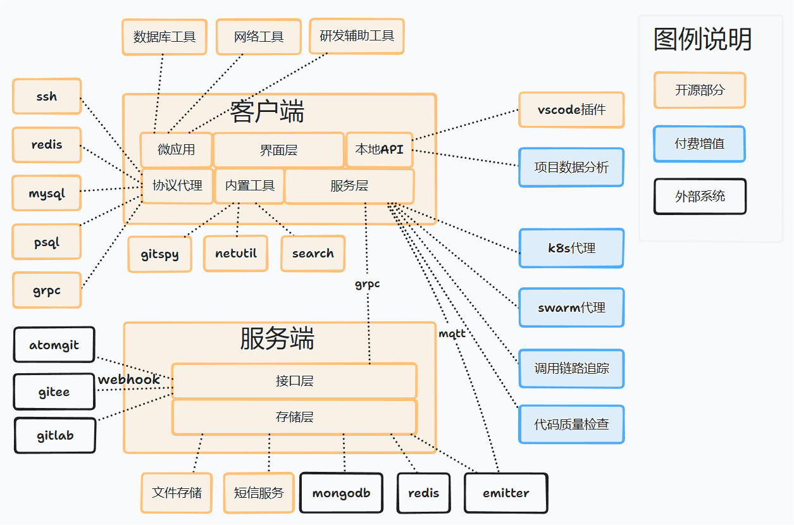

# 凌鲨简介
凌鲨是专用于软件研发人员/团队专用的效能提升工具，从如下三个方面提升研发效能：
* 为软件研发人员提供了丰富的研发工具
* 为软件研发团队提供项目管理和协作工具
* 通过兴趣组探讨研发知识和技巧

凌鲨使用tauri作为客户端框架，目前支持windows/macos/linux等桌面系统，暂不支持移动端。

# 软件架构


# 项目项目

## 微应用

| 项目                                                                    | 说明                      |
| ----------------------------------------------------------------------- | ------------------------- |
| [ssh-proxy-proto](https://atomgit.com/openlinksaas/ssh-proxy-proto)     | ssh代理协议(swagger)      |
| [mongo-proxy-proto](https://atomgit.com/openlinksaas/mongo-proxy-proto) | mongo代理协议(swagger)    |
| [netutil-proto](https://atomgit.com/openlinksaas/netutil-proto)         | 网络调试代理协议(swagger) |
| [sql-proxy-proto](https://atomgit.com/openlinksaas/sql-proxy-proto)     | sql代理协议(swagger)      |
| [redis-proxy-proto](https://atomgit.com/openlinksaas/redis-proxy-proto) | redis代理协议(swagger)    |
| [minapp](https://atomgit.com/openlinksaas/minapp)                       | 官方微应用集合            |

## 其他

| 项目                                                          | 说明                             |
| ------------------------------------------------------------- | -------------------------------- |
| [gitspy](https://atomgit.com/openlinksaas/gitspy)             | 本地代码仓库工具                 |
| [search-proxy](https://atomgit.com/openlinksaas/search-proxy) | 聚合搜索工具                     |
| [devc](https://atomgit.com/openlinksaas/devc)                 | 研发环境工具                     |
| [proto](https://atomgit.com/openlinksaas/proto)               | 客户端和服务端之间的通讯协议定义 |

# 软件功能
* 个人
  * 本地仓库管理
  * 构建研发环境
  * 研发工具
    * 数据库工具
    * linter配置工具
    * ssh终端
    * 其他小工具
* 团队
  * 文档/静态网页/文件/工作计划/信息面板功能
  * 项目管理
  * API联调
  * 数据标注
  * 研发行为共享
  * 第三方软件信息接入
* 公共部分
  * 兴趣组
  * 聚合搜索
  * 应用市场
  * Docker模块市场


# 开发模式

```bash
cd src-tauri
cargo update
cd ..
yarn tauri dev -f skip-updater
```

# 构建项目
```bash
cd src-tauri
cargo update
cd ..
yarn tauri build -f skip-updater
```